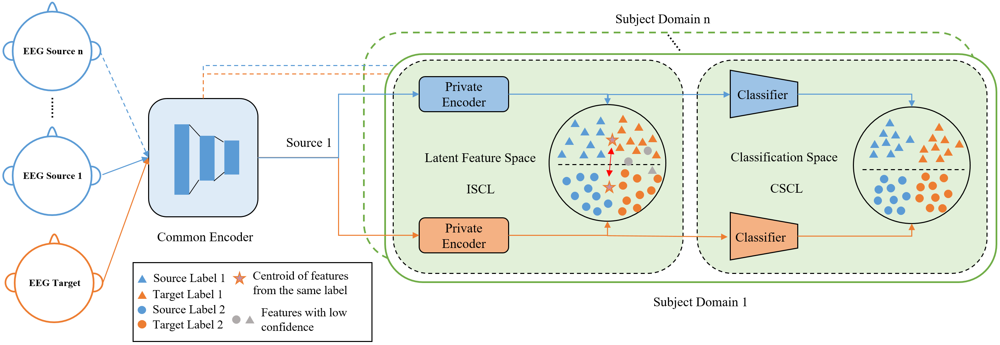

# TransferEEG

This is the code for the model "Multi-Source Structural Deep Clustering"

## Introduction

Unlike traditional domain adaption, the features in our model are not directly aligned from the source domain and the target domain due to significant discrepancy across subjects and sessions of EEG data, an optimal intermediate auxiliary distribution is developed by utilizing the predicted distribution of the target domain to be served as a destination that the target domain should move to. The features of the target domain are first aligned with the corresponding auxiliary domain. Then, during the joint training, the auxiliary distribution was replaced by the actual label distribution of the source domain to regularize the clustering. By employing this approach, the model in this paper are able to uncover the intrinsic structural distribution of the target domain itself without sacrificing the capacity to distinguish between different classes. The approach was also used to improve the distinguishability in the intermediate output space of the model. The predicted distribution is substituted in the initial method outlined above with the distribution of the intermediate features to the clustering centroid associated with each label.

## Architecture



Throughout the training phase, a common encoder is employed to extract fundamental features from both the source domains and the target domain, thereby establishing a shared foundation across all domains. Next, the target domain features are duplicated into multiple copies, with each copy corresponding to a specific source domain feature. Subsequently, an individual encoder and classifier are utilized for each source domain to extract features that are specific to that domain and perform the classification. In order to regularize the deep clustering in the intermediate feature space, ISCL is employed for the output from the private encoder. Additionally, CSCL is utilized to regularize the final deep clustering on the classification.

## Datasets

The datasets used are SEED dataset and SEED-IV dataset. The datasets can be downloaded from [SEED](https://bcmi.sjtu.edu.cn/~seed/index.html) and [SEED-IV](https://bcmi.sjtu.edu.cn/~seed/seed-iv.html).

The dataset format used for training is shown below.

```python
eeg_feature_smooth/
    1/
    2/
    3/
ExtractedFeatures/
    1/
    2/
    3/
```

## Usage

Relative configurations of the model can be adjusted in the `config.py`. To run the model, just run `python main.py`. The output of the model will be printed in the terminal

# Experiment result

| Dataset |  Model   | Cross Subject Accuracy (%) | Cross Subject F1-Score (%) | Cross-session Accuracy (%) | Cross-session F1-Score (%) |
| :-----: | :------: | :------------------------: | :------------------------: | :------------------------: | :------------------------: |
|  SEED   |   DAN    |         67.89±8.04         |           67.86            |         78.45±9.60         |           78.41            |
|  SEED   |  MS-MDA  |        80.68±10.92         |           80.64            |        85.49±11.52         |           85.46            |
|  SEED   |  MS-ADA  |         83.21±5.97         |           83.18            |         87.92±7.49         |           87.88            |
|  SEED   |   UDDA   |         85.25±7.70         |           85.21            |         85.05±9.73         |           85.02            |
|  SEED   | **Ours** |       **88.20±9.69**       |         **88.17**          |       **90.06±8.12**       |         **90.02**          |
| SEED-IV |   DAN    |         41.71±8.25         |           42.68            |        47.45±11.29         |           47.42            |
| SEED-IV |  MS-MDA  |        60.74±13.31         |           60.71            |        59.96±16.74         |           59.92            |
| SEED-IV |  MS-ADA  |        62.86±10.65         |           62.82            |        60.77±14.71         |           60.73            |
| SEED-IV |   UDDA   |        67.49±10.13         |           67.46            |        67.19±10.66         |           67.16            |
| SEED-IV | **Ours** |      **71.49±13.58**       |         **71.46**          |      **69.96±14.75**       |         **69.94**          |

if you find the paper or this repo useful, please cite

```
@article{chen2025cross,
  title={Cross-Subject and Cross-Session EEG Emotion Recognition based on Multi-Source Structural Deep Clustering},
  author={Chen, Yiyuan and Xu, Xiaodong and Qin, Xiaowei},
  journal={IEEE Transactions on Cognitive and Developmental Systems},
  year={2025},
  publisher={IEEE}
}
```

